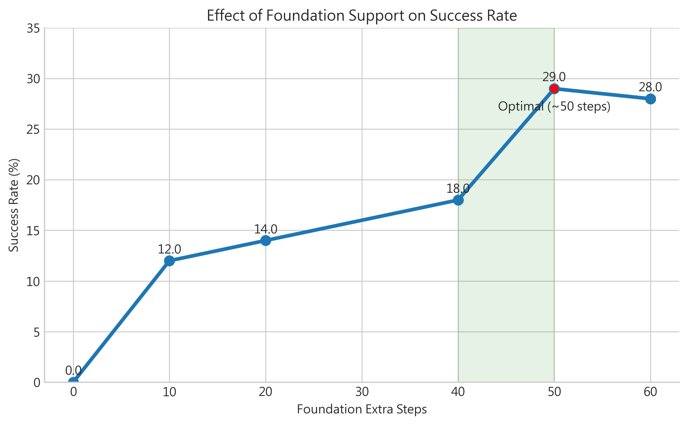
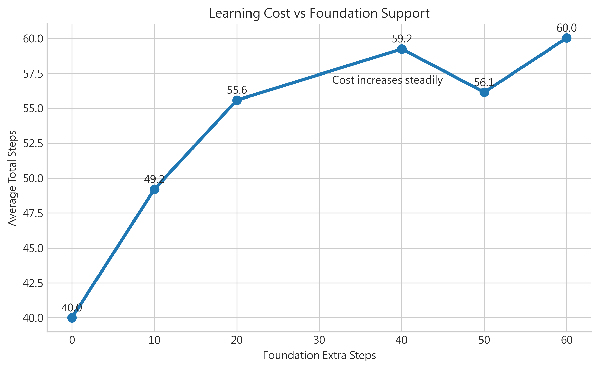
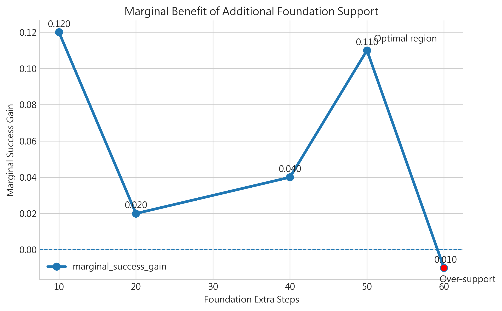
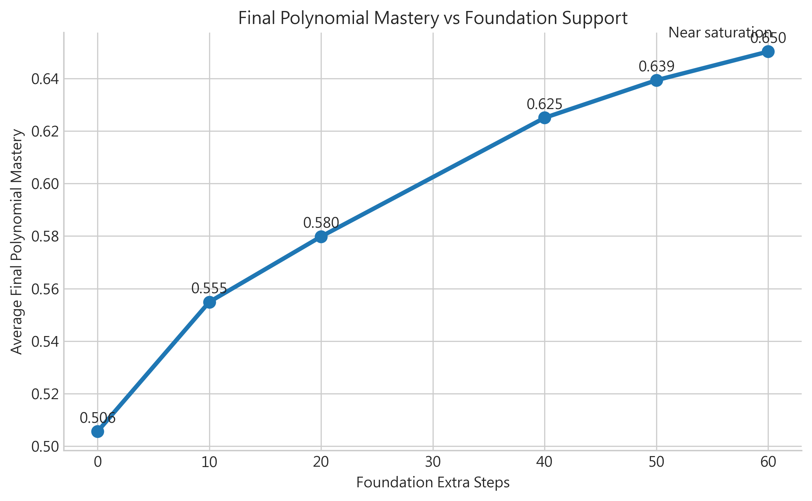

# Experiment 3：Weak Foundation Support

## 一、實驗目的（Objective）

本實驗聚焦於一個關鍵教育問題：當學習者屬於 **Weak 類型**（基礎能力較弱）時，若在主線學習前投入額外基礎補救資源，是否能有效提升最終學習成果？

相較於只觀察「有沒有進步」，本實驗更重視**決策層問題**：

- 需要投入多少 foundation support 才有明顯效果？
- 成效提升是否會出現邊際遞減（diminishing returns）？
- 在有限時間與教學成本下，較合理的資源配置區間為何？

因此，本實驗的定位是「**弱學生補基礎成本效益分析**」，目標是提供可辯護、可實作的教學決策依據。

## 二、實驗設定（Experimental Setup）

### 1. 學生模型（Weak Learner）

本實驗固定只分析 `Weak` 類型學生，避免不同類型混雜造成解釋困難。

| 項目 | 設定內容 |
|---|---|
| 學生類型 | Weak |
| 初始能力特性 | 較低初始 mastery、基礎不穩定 |
| 分析目標 | 觀察額外 foundation support 對 success 與 mastery 的影響 |
| 模擬方式 | episode-based 重複模擬，統計平均結果 |

### 2. 策略（AB3）

本實驗固定使用 `AB3_PPO_Dynamic`，代表系統使用動態路由決策與補救流程。

| 項目 | 設定內容 |
|---|---|
| 策略名稱 | AB3_PPO_Dynamic |
| 目的 | 在弱學生條件下評估「額外基礎支持」的成本效益 |
| 比較方式 | 固定策略，僅改變 foundation extra steps |

### 3. 變數（Foundation Extra Steps）

本實驗的自變數為 `foundation_extra_steps`，設定如下：

- 0
- 10
- 20
- 40
- 50
- 60

此設計代表：在主線學習之外，額外允許的基礎補救步數上限。

### 4. 評估指標（Metrics）

| 指標 | 定義 | 解讀重點 |
|---|---|---|
| Success Rate | 達成目標條件的比例 | 主成效指標 |
| Avg Total Steps | 每回合平均總步數 | 學習成本指標 |
| Marginal Success Gain | 與前一設定相比的 success 增量 | 是否仍值得增加資源 |
| Avg Final Polynomial Mastery | 最終目標能力平均值 | 支援性效果證據 |

## 三、核心結果（Key Results）

### 1. 主效果：Success Rate



此圖顯示額外 foundation support 對成功率的直接影響。從本次模擬結果可見，success rate 隨支持量增加整體上升，且在 `50` 步附近達到明顯高點。

### 2. 成本：Learning Cost



此圖顯示平均總步數（學習成本）如何隨支持量變化。可觀察到投入更多 foundation support 通常伴隨成本增加，說明「成效提升」與「時間成本」需同時評估。

### 3. 是否值得再加：Marginal Gain



此圖聚焦 `marginal_success_gain`，直接回答「再加 support 是否仍有明顯收益」。本次結果在高支持區段已出現趨近零、甚至轉負的增量，呈現邊際遞減特徵。

### 4. 輔助成效：Final Mastery



此圖顯示最終 polynomial mastery 隨支持量上升而提升，支持「補基礎有助能力累積」的觀察；但其決策優先度低於 success 與 marginal gain。

## 四、關鍵發現（Key Findings）

1. **補基礎確實有效**：相較於 `0` 支持，加入 foundation extra steps 後 success 與最終 mastery 均有改善。  
2. **效益並非線性上升**：從 marginal success gain 可見，新增支持在高區段出現明顯遞減。  
3. **存在可操作的最佳區間**：本次結果顯示約在 `50` steps 附近可取得較佳「成效/成本」平衡。  
4. **超過一定支持量後回報有限**：例如 `50 -> 60` 的成功率增量已接近 0 或轉負，代表持續加碼不一定帶來等比例收益。  

## 五、結論（Conclusion）

Experiment 3 證實：對 Weak 學生增加 foundation support 能改善整體學習結果，但此改善存在明顯邊際遞減。就本次模擬而言，決策上不應無限制提高支持量，而應採取「在有效區間內配置資源」的策略。綜合 success、cost 與 marginal gain，本研究支持將 **約 50 steps** 作為較具可行性的參考點。

## 六、與 Experiment 2 的關係

Experiment 2 說明了 AB3 下不同學生類型的行為差異，並指出 Weak 學生較容易長期停留在補救路徑、且更易遇到結構性瓶頸。Experiment 3 進一步把這個觀察轉化為可量化的決策問題：

- 若 Weak 的困境來自基礎不足與後續瓶頸，
- 那麼應投入多少額外基礎支持才最有效？

因此，Experiment 3 是對 Experiment 2 的延伸與落地：從「現象描述」走向「資源配置決策」。

## 七、重現方式（Reproducibility）

在專案根目錄執行以下指令：

```bash
python scripts/run_weak_foundation_support_experiment.py
```

執行後將自動更新本資料夾中的：

- summary CSV
- 子技能與 breakpoint CSV
- 核心決策圖與輔助圖
- 對應 caption（若已啟用）

## 八、未來方向（Future Work）

1. 將「最佳支持步數」由固定值擴展為**個人化動態停止準則**。  
2. 納入更細的子技能先備關係，建立更精準的 foundation curriculum。  
3. 將本模擬結果與真實學習資料對照，驗證外部效度。  
4. 進一步分析「高支持但低回報」樣本，辨識結構性瓶頸的成因。  

## 九、一句話總結（Takeaway）

**Weak 學生需要補基礎，但補救資源存在邊際遞減；本次模擬顯示約 50 steps 是較具決策價值的支持區間。**
