# 實驗 1～4 對應程式架構總覽

本文件用於整理「實驗設計 ↔ 程式模組 ↔ 輸出圖表/結果」的對應關係，作為專案維護、除錯、論文整理與簡報製作的共同索引。內容以目前專案中的真實檔案與實際輸出為準，主軸聚焦於實驗 1～4，不額外擴張其他支線。

---

## 一、四個實驗的研究定位總表

| 實驗編號 | 實驗名稱 | 研究問題 | 核心輸入 | 核心輸出 | 對應主程式 |
|---------|---------|---------|---------|---------|---------|
| Experiment 1 | Baseline vs AB2 vs AB3 | 動態補救（AB3）是否優於靜態/基線策略（AB1/AB2） | 策略設定、學生類型、MAX_STEPS（30/40/50） | strategy summary、cross-step summary、ablation 主圖 | `scripts/run_multi_steps_experiment.py` |
| Experiment 2 | AB3 Student Type Analysis | AB3 對不同學生類型是否採取差異化策略，且為何有效 | AB3 trajectory logs（`mastery_trajectory.csv`）與 episode 結果 | policy behavior、efficiency、mastery trajectory、AB3 細部 summary | `scripts/simulate_student.py` |
| Experiment 3 | Weak Foundation Support | Weak 學生需要多少基礎補強步數才具成本效益 | Weak + AB3、foundation extra steps（含高步數擴充） | support summary、marginal gain、cost/mastery/breakpoint 圖 | `scripts/run_weak_foundation_support_experiment.py` |
| Experiment 4 | Weak + RAG Tutor（Extension） | 在強 baseline（Exp3）上，RAG 是否仍有額外價值 | Weak + AB3 + foundation baseline，RAG 開關對照 | rag summary、efficiency summary、subskill/breakpoint 圖 | `scripts/run_rag_intervention_experiment.py` |

---

## 二、實驗對應程式模組總覽

| 程式檔案 | 角色定位 | 主要功能 | 對應實驗 |
|---------|---------|---------|---------|
| `scripts/simulate_student.py` | 核心模擬引擎（共用） | 執行 AB1/AB2/AB3 episode、更新 mastery、輸出 summary 與 trajectory，並在 full mode 產生 Experiment 2 主圖與 caption。 | 1, 2（核心） |
| `scripts/run_multi_steps_experiment.py` | Experiment 1 正式 runner | 批次執行 MAX_STEPS（30/40/50），產生 cross-step summary 與 ablation 主圖，輸出集中到 `experiment_1_ablation/`。 | 1 |
| `scripts/run_weak_foundation_support_experiment.py` | Experiment 3 正式 runner | 針對 Weak 執行 foundation support 成本分析（含擴充步數），輸出 CSV、主圖、caption 與 README。 | 3 |
| `scripts/run_rag_intervention_experiment.py` | Experiment 4 正式 runner（延伸） | 在 Weak+AB3+foundation 基準上比較 baseline vs RAG，輸出效能、子技能與 breakpoint 分析。 | 4 |
| `scripts/plot_experiment_results.py` | 圖表輸出層（共用） | 從既有 CSV 重建 ablation、student-type、weak-support 與 RAG 圖表，並維持 caption 輸出。 | 1, 2, 3, 4 |
| `scripts/run_ablation_experiment.py` | 消融替代入口（adapter） | 封裝 `core.adaptive.ablation_experiment` 的執行介面，提供另一條 AB 消融執行路徑。 | 1（替代入口） |
| `core/adaptive/ablation_experiment.py` | 底層實驗模組 | 提供 `ExperimentConfig` 與 `run_experiment`，作為 core 消融流程基礎。 | 1 |
| `scripts/organize_experiment_outputs.py` | 歷史整理工具 | 將既有輸出同步到各實驗子資料夾；目前主流程已以 source 端直接輸出為主。 | 輔助整理 |

> 註：`scripts/ablation_experiment.py` 目前不存在；實際使用的是 `scripts/run_ablation_experiment.py` + `core/adaptive/ablation_experiment.py`。

---

## 三、實驗 1～4 對應程式架構圖（Mermaid）

```mermaid
flowchart TD
    P0["Shared Simulation Core\nscripts/simulate_student.py"]
    P1["Shared Plotting Layer\nscripts/plot_experiment_results.py"]

    subgraph E1["Experiment 1: Baseline vs AB2 vs AB3"]
      E1A["Runner\nscripts/run_multi_steps_experiment.py"] --> E1B["CSV\nexperiment1_summary_table.csv/.md\nablation_strategy_summary.csv\nablation_strategy_by_student_type_summary.csv\nmulti_steps_strategy_summary.csv\nmulti_steps_strategy_by_type_summary.csv"]
      E1A --> E1C["Figures\nfig_multi_steps_success_rate.png\nfig_multi_steps_efficiency.png\nfig_ablation_strategy_breakdown.png\nfig_ablation_by_student_type.png"]
      E1A --> E1D["Output Folder\nreports/experiment_1_ablation/"]
    end

    subgraph E2["Experiment 2: AB3 Student Type Analysis"]
      E2A["Runner\npython scripts/simulate_student.py"] --> E2B["CSV\nmastery_trajectory.csv\nexperiment2_student_type_summary.csv\nab3_* summaries"]
      E2A --> E2C["Figures\nexperiment2_policy_behavior_summary.png\nexperiment2_efficiency_by_student_type.png\nmastery_trajectory_representative_episode.png\nmastery_trajectory_average_by_student_type.png"]
      E2A --> E2D["Captions\nfigure_caption_experiment2_summary.md\nfigure_caption_mastery_episode.md\nfigure_caption_mastery_average.md"]
      E2A --> E2E["Output Folder\nreports/experiment_2_ab3_student_types/"]
    end

    subgraph E3["Experiment 3: Weak Foundation Support"]
      E3A["Runner\nscripts/run_weak_foundation_support_experiment.py"] --> E3B["CSV\nweak_foundation_support_summary.csv\nweak_foundation_subskill_summary.csv\nweak_foundation_breakpoint_summary.csv"]
      E3A --> E3C["Figures\nfig_weak_foundation_success_rate.png\nfig_weak_foundation_cost.png\nfig_weak_foundation_marginal_gain.png\nfig_weak_foundation_mastery.png\nfig_weak_foundation_subskill_gain.png\nfig_weak_foundation_breakpoint_shift.png"]
      E3A --> E3D["Output Folder\nreports/experiment_3_weak_foundation_support/"]
    end

    subgraph E4["Experiment 4: Weak + RAG Tutor (Extension)"]
      E4A["Runner\nscripts/run_rag_intervention_experiment.py"] --> E4B["CSV\nrag_vs_baseline_summary.csv\nrag_student_type_summary.csv\nrag_subskill_summary.csv\nrag_breakpoint_shift.csv\nrag_efficiency_summary.csv"]
      E4A --> E4C["Figures\nfig_rag_success_rate.png\nfig_rag_mastery.png\nfig_rag_subskill_gain.png\nfig_rag_breakpoint_shift.png\nfig_rag_efficiency.png"]
      E4A --> E4D["Output Folder\nreports/experiment_4_rag_tutor/"]
    end

    P0 --> E1
    P0 --> E2
    P0 --> E3
    P0 --> E4
    P1 --> E1
    P1 --> E2
    P1 --> E3
    P1 --> E4
```

---

## 四、各實驗的最終輸出物對照

| 實驗 | 主要輸出檔 | 用途 | 是否主展示 |
|------|-----------|------|-----------|
| 1 | `reports/experiment_1_ablation/experiment1_summary_table.md` | 實驗一主表（可直接放報告） | 是 |
| 1 | `reports/experiment_1_ablation/experiment1_summary_table.csv` | 主表原始數值 | 是 |
| 1 | `reports/experiment_1_ablation/ablation_strategy_summary.csv` | 三策略整體比較 | 是 |
| 1 | `reports/experiment_1_ablation/ablation_strategy_by_student_type_summary.csv` | 三策略 × student type 比較 | 是 |
| 1 | `reports/experiment_1_ablation/multi_steps_strategy_summary.csv` | 跨 MAX_STEPS 主摘要 | 是 |
| 1 | `reports/experiment_1_ablation/multi_steps_strategy_by_type_summary.csv` | 跨 MAX_STEPS × student type 摘要 | 是 |
| 1 | `reports/experiment_1_ablation/fig_multi_steps_success_rate.png` | 主展示圖（成功率趨勢） | 是 |
| 1 | `reports/experiment_1_ablation/fig_multi_steps_efficiency.png` | 效率/權衡圖 | 是 |
| 1 | `reports/experiment_1_ablation/fig_ablation_strategy_breakdown.png` | 策略分解圖 | 是 |
| 1 | `reports/experiment_1_ablation/fig_ablation_by_student_type.png` | student type × strategy 圖 | 是 |
| 1 | `reports/experiment_1_ablation/README.md` | 實驗一資料夾說明 | 是 |
| 2 | `reports/experiment_2_ab3_student_types/experiment2_policy_behavior_summary.png` | AB3 分配策略差異主圖 | 是 |
| 2 | `reports/experiment_2_ab3_student_types/experiment2_efficiency_by_student_type.png` | 各類型學習成本圖 | 是 |
| 2 | `reports/experiment_2_ab3_student_types/mastery_trajectory_average_by_student_type.png` | 平均 mastery 成長軌跡 | 是 |
| 2 | `reports/experiment_2_ab3_student_types/mastery_trajectory_representative_episode.png` | 代表性 episode 補救相位圖 | 是 |
| 2 | `reports/experiment_2_ab3_student_types/experiment2_student_type_summary.csv` | Experiment 2 主摘要表 | 是 |
| 2 | `reports/experiment_2_ab3_student_types/ab3_student_type_summary.csv` | AB3 student type 摘要 | 支援 |
| 2 | `reports/experiment_2_ab3_student_types/ab3_student_type_detailed_summary.csv` | AB3 詳細摘要 | 支援 |
| 2 | `reports/experiment_2_ab3_student_types/ab3_failure_breakpoint_summary.csv` | 失敗瓶頸分布 | 支援 |
| 2 | `reports/experiment_2_ab3_student_types/mastery_trajectory.csv` | step-level 軌跡原始資料 | 支援 |
| 2 | `reports/experiment_2_ab3_student_types/figure_caption_experiment2_summary.md` | 主圖圖說 | 是 |
| 2 | `reports/experiment_2_ab3_student_types/figure_caption_mastery_average.md` | 平均軌跡圖說 | 是 |
| 2 | `reports/experiment_2_ab3_student_types/figure_caption_mastery_episode.md` | 代表 episode 圖說 | 是 |
| 2 | `reports/experiment_2_ab3_student_types/README.md` | 實驗二資料夾說明 | 是 |
| 3 | `reports/experiment_3_weak_foundation_support/weak_foundation_support_summary.csv` | foundation support 主摘要 | 是 |
| 3 | `reports/experiment_3_weak_foundation_support/weak_foundation_subskill_summary.csv` | 子技能增益摘要 | 支援 |
| 3 | `reports/experiment_3_weak_foundation_support/weak_foundation_breakpoint_summary.csv` | breakpoint 分布摘要 | 支援 |
| 3 | `reports/experiment_3_weak_foundation_support/fig_weak_foundation_success_rate.png` | 主效果圖 | 是 |
| 3 | `reports/experiment_3_weak_foundation_support/fig_weak_foundation_cost.png` | 學習成本圖 | 是 |
| 3 | `reports/experiment_3_weak_foundation_support/fig_weak_foundation_marginal_gain.png` | 邊際效益圖 | 是 |
| 3 | `reports/experiment_3_weak_foundation_support/fig_weak_foundation_mastery.png` | 最終 mastery 圖 | 是 |
| 3 | `reports/experiment_3_weak_foundation_support/fig_weak_foundation_subskill_gain.png` | 子技能影響圖 | 支援 |
| 3 | `reports/experiment_3_weak_foundation_support/fig_weak_foundation_breakpoint_shift.png` | breakpoint shift 圖 | 支援 |
| 3 | `reports/experiment_3_weak_foundation_support/figure_caption_exp3_success.md` | 成功率圖說 | 是 |
| 3 | `reports/experiment_3_weak_foundation_support/figure_caption_exp3_cost.md` | 成本圖說 | 是 |
| 3 | `reports/experiment_3_weak_foundation_support/figure_caption_exp3_marginal.md` | 邊際效益圖說 | 是 |
| 3 | `reports/experiment_3_weak_foundation_support/figure_caption_exp3_mastery.md` | mastery 圖說 | 是 |
| 3 | `reports/experiment_3_weak_foundation_support/README.md` | 實驗三資料夾說明 | 是 |
| 4 | `reports/experiment_4_rag_tutor/rag_vs_baseline_summary.csv` | RAG vs baseline 主摘要 | 是 |
| 4 | `reports/experiment_4_rag_tutor/rag_student_type_summary.csv` | RAG 條件 student type 摘要 | 支援 |
| 4 | `reports/experiment_4_rag_tutor/rag_subskill_summary.csv` | RAG 子技能摘要 | 支援 |
| 4 | `reports/experiment_4_rag_tutor/rag_breakpoint_shift.csv` | RAG breakpoint 分布 | 支援 |
| 4 | `reports/experiment_4_rag_tutor/rag_efficiency_summary.csv` | 學習效率摘要（新增） | 是 |
| 4 | `reports/experiment_4_rag_tutor/fig_rag_success_rate.png` | 成功率比較圖 | 是 |
| 4 | `reports/experiment_4_rag_tutor/fig_rag_mastery.png` | 最終 mastery 比較圖 | 支援 |
| 4 | `reports/experiment_4_rag_tutor/fig_rag_subskill_gain.png` | 子技能增益比較圖 | 支援 |
| 4 | `reports/experiment_4_rag_tutor/fig_rag_breakpoint_shift.png` | breakpoint shift 圖 | 支援 |
| 4 | `reports/experiment_4_rag_tutor/fig_rag_efficiency.png` | 學習效率主圖 | 是 |
| 4 | `reports/experiment_4_rag_tutor/README.md` | 實驗四研究說明 | 是 |

---

## 五、各實驗正式重跑入口

| 實驗 | 正式入口程式 | 指令 | 輸出資料夾 | 是否需額外跑 plotter |
|------|-------------|------|-----------|----------------------|
| Experiment 1 | `scripts/run_multi_steps_experiment.py` | `python scripts/run_multi_steps_experiment.py` | `D:\Python\Mathproject\reports\experiment_1_ablation\` | 否（runner 會自動產圖） |
| Experiment 2 | `scripts/simulate_student.py` | `python scripts/simulate_student.py` | `D:\Python\Mathproject\reports\experiment_2_ab3_student_types\` | 否（full mode 自動產圖） |
| Experiment 3 | `scripts/run_weak_foundation_support_experiment.py` | `python scripts/run_weak_foundation_support_experiment.py` | `D:\Python\Mathproject\reports\experiment_3_weak_foundation_support\` | 否（runner 會自動產圖） |
| Experiment 4 | `scripts/run_rag_intervention_experiment.py` | `python scripts/run_rag_intervention_experiment.py` | `D:\Python\Mathproject\reports\experiment_4_rag_tutor\` | 否（runner 會自動產圖） |

---

## 六、每個實驗的目前結論摘要

### Experiment 1（策略有效性）
- **主問題**：策略本身是否有效（AB1/AB2/AB3）。
- **目前發現**：`AB3_PPO_Dynamic` 整體表現最佳，動態補救優於 static/baseline。
- **步數結論**：在目前設定下，`MAX_STEPS=50` 附近整體表現最好。
- **展示狀態**：已完成工程與展示收斂（主表 + 主圖 + README）。

### Experiment 2（AB3 為何有效）
- **主問題**：AB3 是否對不同 student type 採取不同策略行為。
- **目前發現**：Careless / Average / Weak 的 remediation/mainline 比例與平均步數顯著不同；Weak 收斂較慢且成本較高。
- **研究意義**：此實驗解釋 AB3 成效來源（策略分配機制），而非只報成功率。
- **展示狀態**：已完成展示層重構（policy、efficiency、trajectory、caption）。

### Experiment 3（Weak 補強成本）
- **主問題**：Weak 學生應補多少 foundation support 才合理。
- **目前發現**：增加 support 可改善表現；約 `40–50 steps` 為較合理區間；`60` 後邊際效益明顯下降，接近負報酬區。
- **研究意義**：補救有效，但存在成本上限與 diminishing returns。
- **展示狀態**：已完成圖表收斂、caption 與 README。 

### Experiment 4（RAG 邊際價值）
- **主問題**：在強 baseline 上，RAG 是否仍有額外價值。
- **目前發現**：RAG 相對 baseline 有小幅改善；Final mastery 幾乎無顯著差異；learning efficiency 約 1% 左右小幅提升。
- **限制觀察**：weak subskill targeting 未呈現非常強的集中改善，`family_isomorphism` 仍是主要瓶頸。
- **展示狀態**：已建立 efficiency 分析與 README，結論屬邊際改善。 

---

## 七、Experiment 1 數值統計總表（自動生成）

此表由 `simulate_student.py`/Experiment 1 runner 自動產生，資料來自當次真實模擬結果（非手動填寫）。  
主要用途是補強圖表（success rate / tradeoff）的數值對照，方便論文與簡報引用。

| MAX_STEPS | Strategy | Success Rate (%) | Avg Steps | Avg Unnecessary Remediations | Avg Final Mastery |
|-----------|----------|------------------|-----------|------------------------------|-------------------|
| 50 | AB1_Baseline | 36.67 | 47.68 | 0.00 | 0.76 |
| 50 | AB2_RuleBased | 20.67 | 49.19 | 3.51 | 0.73 |
| 50 | AB3_PPO_Dynamic | 72.67 | 38.70 | 0.34 | 0.77 |

結論：在目前已產生的統計中，`AB3_PPO_Dynamic` 具有最高成功率（72.67%）。在 `MAX_STEPS=50` 條件下，AB3 表現最佳，顯示動態補救策略在較寬步數預算下仍具優勢。

---

## 八、維護建議（簡短）

- 新增實驗前，先判斷是否屬於實驗 1～4 主軸，避免分支擴散。
- 圖表與 caption 一律由真實 logs/CSV 自動重建，不手動改圖或補數字。
- 優先維持 `simulate_student.py` 與各 runner 的輸出介面穩定。
- 若調整欄位名稱，需同步更新 runner、plotter、caption 生成流程。
- 實驗 4 維持 Extension/Appendix 定位，不與主結論（實驗 1～3）混淆。
- 目前四個實驗已可獨立重跑；後續優先控管輸出穩定，避免再擴張新分支。

---

## 九、目前專案整體狀態

- 四個實驗均已具備獨立 runner 與專屬輸出資料夾（`experiment_1` ~ `experiment_4`）。
- 各實驗主輸出（CSV / PNG / caption / README）已基本完成分流與收斂。
- Experiment 1～3 屬主線證據鏈；Experiment 4 屬延伸驗證，定位為補充而非主結論。
- 現階段最重要工作為：**維持輸出穩定、確保重跑一致性、避免新增未收斂支線**。
